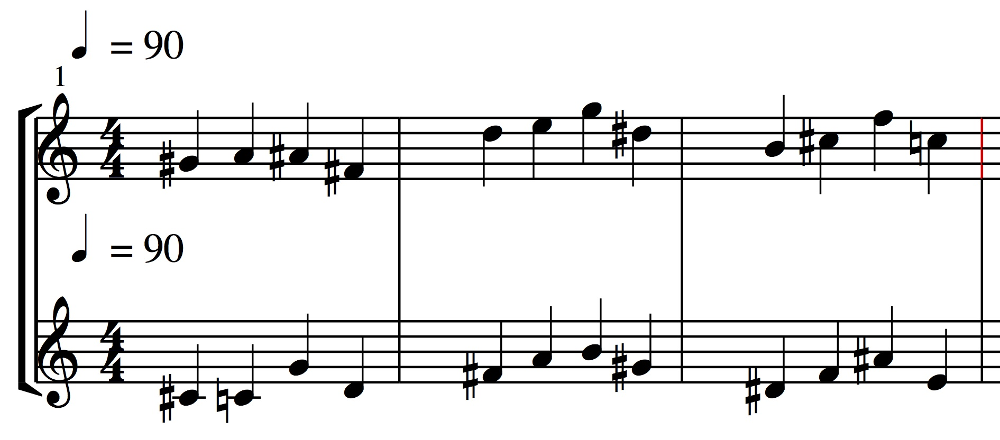

<div id="table-of-contents">
<h2>Table of Contents</h2>
<div id="text-table-of-contents">
<ul>
<li><a href="#orgf7ac5b7">1. Cluster Engine</a>
<ul>
<li><a href="#org4dc578f">1.1. References</a></li>
</ul>
</li>
<li><a href="#org2755f3a">2. Installation</a>
<ul>
<li><a href="#orga381f84">2.1. PWGL</a></li>
<li><a href="#org5238bab">2.2. Common Lisp</a></li>
<li><a href="#org11e9b4e">2.3. Updating your software</a></li>
</ul>
</li>
<li><a href="#org71bb48a">3. Usage</a>
<ul>
<li><a href="#org12dc5f1">3.1. PWGL</a></li>
<li><a href="#org4d58c24">3.2. Common Lisp</a></li>
<li><a href="#org079c9dc">3.3. Cluster Rules</a></li>
</ul>
</li>
</ul>
</div>
</div>

<a id="orgf7ac5b7"></a>

# Cluster Engine

Cluster Engine is a constraint solver for solving polyphonic constraint satisfaction problems where both the pitch and the rhythmic structure can be restricted by an arbitrary number of constraints (rules), and a constraint solver then searches for a solution that is consistent with all constraints. This library supports user-defined rules, and highly flexible ways to control which aspects of the resulting score are controlled by certain rules. For example, you can independently control with compositional rules the melody and harmony of the music you generate. 

Cluster Engine is the successor of PWMC (Sandred, 2010). It was originally developed as a library for the free composition environment [PWGL](http://www2.siba.fi/pwgl). 

The present version still runs in PWGL, but also on plain Common Lisp in order to make it useable within [Opusmodus](http://opusmodus.com) and a &#x2013; via a SBCL interface &#x2013; in the music and media programming environment Max (Vincenot, 2017).

Cluster Engine has been tested on PWGL (based on Lispworks), SBCL and Opusmodus (Clozure CL).


<a id="org4dc578f"></a>

## References

Sandred, Ö. (2010) PWMC, a Constraint-Solving System for Generating Music Scores. *Computer Music Journal*. 34(2), 8–24.

Vincenot, J. (2017) LISP in Max: Exploratory Computer-Aided Composition in Real-Time. *ICMC 2017*. 



<a id="org2755f3a"></a>


# Usage


<a id="org12dc5f1"></a>

## PWGL

If you use Cluster Engine in PWGL, you load the library in PWGL with File > Load Library&#x2026;

The library comes with a tutorial, which you find under Help > PWGL Tutorial&#x2026; In the tutorial browser that opens then move to Library Tutorials > cluster-engine. The tutorial consists of a collection of live patches with comments and documentation slides. 


<a id="org4d58c24"></a>


## Common Lisp

Cluster Engine is an [ASDF](https://common-lisp.net/project/asdf/) system (ASDF is the de facto standard for building Common Lisp software), and you can load it into your Lisp compiler as follows.

    (require :cluster-engine)
	
	``` lisp
(defun test () )

	```


The library should now be loaded, and you solve musical constraint satisfaction problems. The first example below is an "empty" problem without any constraints yet. The function `clusterengine` is the constraint solver. Its first three arguments specify the number of variables (quasi notes) per voice (10 in this example), whether or not to randomise the solution (T) and whether to use additional debugging features (nil).  After a list of constraints (empty) the function expects specifications for various domains. These specifications support a mini language for flexibility, the specifications below are very simple. Only a single time signature is allowed (all bars are in 3/4); the single voice can consist of quarter notes and eighth notes; and possible pitches are middle C and C# (MIDI note numbers 60 and 61).  

    (ce::clusterengine 
     10 t nil           ; settings
     nil                ; no constraints
     '((3 4))           ; metric domain
     ;; domain of rhythmic values and pitches for one voice
     '(((1/4) (1/8))   
       ((60) (61))))

`clusterengine` outputs a declaration of the sequences of time signatures, rhythmic values and pitches for each voice. 

    (; rhythmic values of voice 1
     (1/4 1/8 1/8 1/8 1/4 1/8 1/8 1/8 1/8 1/8)
     ; pitches
     (60 61 60 61 61 60 60 60 60 61)
     ; time signatures
     ((3 4) (3 4) (3 4)))

The output is automatically translated into a notated score in PWGL, and can be translated into a OpusModus score with the function `cluster-engine-score`, which in turn can be translated into a notated score with `preview-score` &#x2013; both functions provided by the library [tot](https://github.com/tanders/tot).

    (:|1| ((q c4 e cs4 c4 cs4 cs4 tie) (e cs4 c4 c4 c4 c4 cs4)))

The above constraint problem does not include any musical rules. Without a detailed discussion, in the following a polyphonic example with a few rules is shown (example 8a translated from the PWGL tutorial into plain Common Lisp). Here, the first rule forces both voices to create 12-tone rows. Rule 2 constrains all harmonic intervals between both voices to consonant intervals or 3, 4, 7, 8 or 9 semitones. Finally, the last rule forbids any voice crossings. A possible result is shown below the code.

    (ce::clusterengine 
     12 t nil 
     (append 
      ;; rule 1
      (ce::r-pitches-one-voice #'(lambda (x) 
    			       (not (member (mod (car (last x)) 12)
    					    (mapcar #'(lambda (a) (mod a 12)) (butlast x)))))
    			   '(0 1) :all-pitches)
      ;; rule 2
      (ce::r-pitch-pitch #'(lambda (x) 
    			 (member (mod (ce::apply-minus x) 12) '(3 4 7 8 9)))
    		     '(0 1) '(0) :all :no_grace :pitch)
      ;; rule 3
      (ce::R-pitch-pitch #'(lambda (x) (>= (first x) (second x)) )
    		     '(0 1) '(0) :all :no_grace :pitch)) 
     '((4 4)) 
     '(;; domains of rhythmic values and pitches of voice 1
       ((1/4)) 
       ((60) (61) (62) (63) (64) (65) (66) (67) (68) (69) (70) (71) (72) (73) (74) (75) (76) (77) (78) (79))
       ;; domains of rhythmic values and pitches of voice 2
       ((1/4)) 
       ((60) (61) (62) (63) (64) (65) (66) (67) (68) (69) (70) (71) (72) (73) (74) (75) (76) (77) (78) (79))))



For further information refer to the PWGL tutorial for now. Pretty much all PWGL boxes have their equivalent Common Lisp function/macro with the same arguments. An exception is the function `clusterengine` itself, where domains of rhythmic values and pitches are defined in Common Lisp as shown above. 


<a id="org079c9dc"></a>


## Cluster Rules

The Common Lisp library [Cluster Rules](https://github.com/tanders/cluster-rules) extends Cluster Engine by a collection of predefined musical constraints and that way makes it more easy to use. The equivalent PWGL library is [PWGL Cluster Rules](https://github.com/tanders/pwgl-cluster-rules). 

